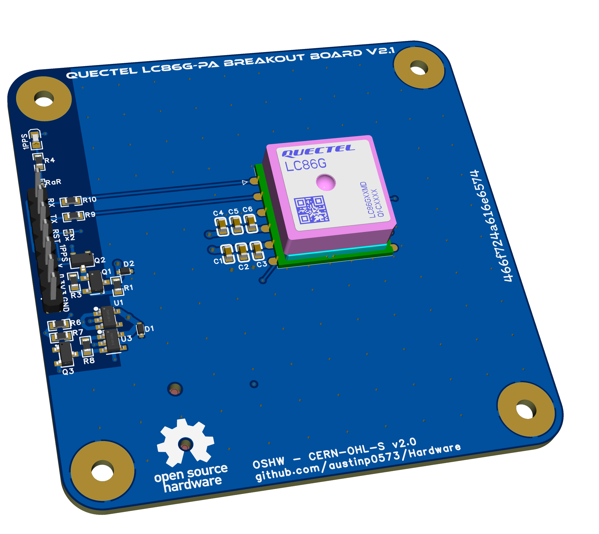

# Quectel LC86G-PA Breakout Board V2.1

A compact, easy-to-integrate GNSS breakout board for the Quectel LC86G-PA GPS module.  
Designed for use with microcontrollers (3.3V logic), prototyping platforms, or embedded systems requiring fast and accurate satellite positioning.

## 🔧 Features

- Supports UART communication
- Integrated CR1225 battery backup for "warm start"
- Filtered and ESD-protected power input
- Clearly labeled headers and silkscreen for easy assembly and use
- Mounting holes for enclosure or protoboard use

## 📁 What's Included

- `*.eprj`: EasyEDA Pro source project file
- `*.png`: Board views and schematic preview
- `*.step`: 3D model of the assembled board
- `*.zip`: Gerber exports, BOM, and Altium-compatible files
- `*.xlsx`: Full bill of materials for sourcing

## 🚀 Getting Started

**Input voltage:** 3.3V regulated  
**UART output:** Default baud rate is 9600 bps  
**Pinout and silkscreen:** See `Top Layer.png` and schematic image  
**Backup battery:** CR1225 powers V_BCKP pin (optional, but improves TTFF)

## 📜 License

This project is licensed under the **CERN Open Hardware License v2**.  
You are free to modify, manufacture, or redistribute with proper attribution.

## 🙏 Acknowledgments

Special thanks to [@roquemt](https://github.com/roquemt) — his guidance and insight were instrumental in helping me bring this project to life as my first successful PCB design.

Also, sincere appreciation to [StuartProjects](https://github.com/StuartsProjects) for the wealth of open-source work related to GNSS and RF. In particular, the [GPS performance comparisons](https://github.com/StuartsProjects/GPSTutorial/tree/master/GPS%20performance%20comparisons) repo was a valuable reference throughout development.

## ❓Need Help?

Feel free to:
- [Open an issue](https://github.com/austinp0573/Hardware/issues) on this repo
- If anyone would like help recreating the project or if there's anyway I could otherwise assist your creations, I'd be happy to.

Pull requests and feedback are welcome!

---  

&nbsp;

**466f724a616e6574**